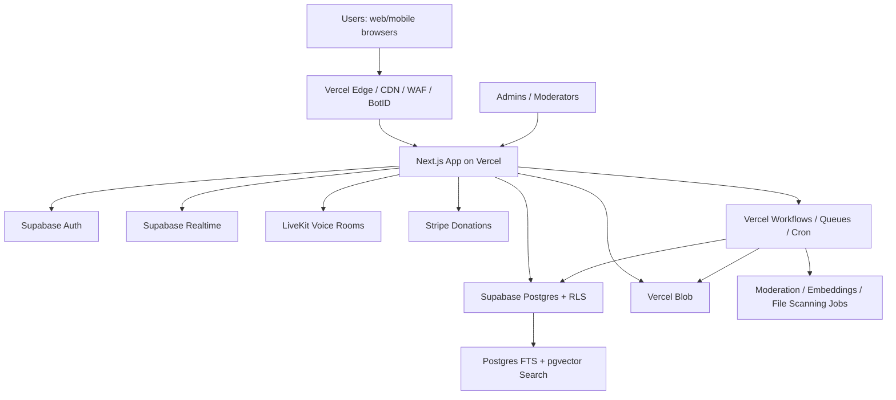

# AI-OSS.net Architecture & Product Specification  
## Source of Truth for Development Agents, Engineers, Moderators, and Administrators

**Project:** AI-OSS.net  
**Primary production URL:** `https://www.ai-oss.net/`  
**Canonical domain policy:** `https://ai-oss.net/` must permanently redirect to `https://www.ai-oss.net/` using HTTP 308.  
**Document version:** 1.0  
**Document date:** 2026-06-10  
**Status:** Launch-complete mandatory architecture. No listed capability is deferred.  
**Audience:** AI coding agents, engineers, product owners, trust and safety operators, moderators, administrators, legal/privacy reviewers, and future employees.

---

## 0. How to Use This Document

This document is the controlling specification for building AI-OSS.net. All code, schemas, routes, policies, UI flows, moderation tooling, and admin tooling must trace back to this document.

Normative keywords:

- **MUST** means required for production launch.
- **MUST NOT** means prohibited.
- **SHOULD** means required unless a documented architecture amendment explains why not.
- **MAY** means optional only when the mandatory behavior is already satisfied.
- **Launch-complete** means this feature is required in the first production-ready build, not a later phase.

No development agent may remove or weaken any requirement in this document without creating a new versioned architecture document with a changelog, rationale, and owner approval.

---

## 1. Mission and Product Definition

AI-OSS.net is an open research coordination platform for independent AI researchers, open-source AI developers, safety researchers, evaluators, and adjacent technical communities. It should feel like a public, community-run research lab: open like a forum, structured like a lab notebook, searchable like a research archive, and moderated like a serious technical community.

The platform combines:

1. **Reddit-like discussions:** users create posts, comments, threaded discussions, votes, feeds, saved posts, and reports.
2. **Zones:** user-created communities similar to subreddits where work happens around topics, labs, projects, teams, and research directions.
3. **Realtime rooms:** text chat rooms and voice rooms attached to zones, papers, posts, or ad-hoc work sessions.
4. **Research publishing:** an arXiv-like publishing area where users can upload papers, full text, PDFs, code links, dataset links, model cards, and versioned revisions without platform vouching or peer-review gatekeeping.
5. **Community vetting:** upvotes, downvotes, comments, replication reports, reproducibility checklists, verification badges, safety flags, and reviewer notes.
6. **Moderation and anti-abuse:** Reddit AutoModerator-inspired rule automation, mod queues, reports, appeals, admin enforcement, bot resistance, anti-brigading, and transparency records.
7. **Administration:** fully built admin panels with granular global admin roles, custom permissions, moderator tiers, audit logs, and emergency controls.
8. **Governance:** community moderator selection and moderator removal by community vote, protected by anti-bot and anti-brigading controls.
9. **Donations:** donation support for the site and development work through payment infrastructure.
10. **Modern responsive UI:** desktop and mobile support, React, Tailwind, accessibility, clean modern design, dark mode, and fast search/discovery.

The platform is **not** a closed proprietary lab. It should emulate the coordination capacity of a closed lab while preserving open, user-published, community-vetted research.

---

## 2. Non-Negotiable Product Requirements

### 2.1 Core Requirements

**REQ-CORE-001** The production site MUST be available at `https://www.ai-oss.net/`.

**REQ-CORE-002** The apex domain `https://ai-oss.net/` MUST permanently redirect to `https://www.ai-oss.net/`.

**REQ-CORE-003** The web application MUST support desktop, tablet, and mobile layouts from the first production build.

**REQ-CORE-004** The preferred frontend stack MUST be React, TypeScript, Tailwind CSS, and Next.js on Vercel.

**REQ-CORE-005** The architecture MUST use services available through Vercel first-party products or the Vercel Marketplace wherever practical.

**REQ-CORE-006** The architecture MUST support independent researchers acting like a distributed lab: discussion, publishing, critique, collaboration, and live work rooms.

**REQ-CORE-007** The platform MUST include account creation, login, logout, account deletion, account export, profile management, privacy controls, and notification controls.

**REQ-CORE-008** The platform MUST include moderation, administration, compliance, and safety tooling in the launch-complete build.

**REQ-CORE-009** The site MUST clearly label user-published research as not endorsed, not peer-reviewed by the platform, and not vouched for by AI-OSS.net unless a future official program explicitly says otherwise.

**REQ-CORE-010** No donation, paid support, or donor badge MUST influence moderation, research ranking, governance votes, or reviewer credibility.

---

## 3. Platform Findings and Chosen Services

This section records the platform decisions based on Vercel’s current docs and marketplace capabilities as of 2026-06-10.

### 3.1 Vercel as Primary Application Platform

AI-OSS.net MUST be deployed as a Vercel project using Next.js App Router, React Server Components where appropriate, Route Handlers, Server Actions, and Vercel Functions.

Vercel Functions are appropriate for server-side application logic, API routes, database access, Stripe webhooks, privacy exports, moderation actions, and short-to-medium background tasks. Vercel’s serverless model is not appropriate for keeping long-lived WebSocket subscription processes inside functions; realtime subscriptions must use a serverless-friendly realtime provider.

### 3.2 End-User Authentication Decision

Vercel has “Vercel Authentication,” but that product is for protecting deployments and limiting deployment access to allowed Vercel users. It is not the public user-account system for AI-OSS.net.

AI-OSS.net MUST use a public end-user auth provider available through the Vercel ecosystem. The launch-complete choice is:

- **Supabase Auth via Vercel Marketplace integration** for public users.
- **Supabase Postgres** as the primary relational database.
- **Supabase Row Level Security** for database-level authorization.
- **Optional Auth.js only if needed** for special provider customization, but Supabase Auth remains the source of truth for user identity.

Rationale: Supabase is available through Vercel Marketplace, provides Auth, Postgres, Realtime, Storage, Row Level Security, and pgvector-compatible search/embedding patterns in one stack.

### 3.3 Database Decision

Primary database:

- **Supabase Postgres** provisioned through Vercel Marketplace.

Mandatory database features:

- Relational source of truth.
- Row Level Security.
- Migrations stored in repository.
- Full-text search columns and indexes.
- Vector embeddings with pgvector for semantic search.
- Audit/event tables.
- Soft-delete and anonymization patterns for public user-generated content.
- Strict separation between public, private, moderator-only, admin-only, and security-sensitive data.

### 3.4 Object Storage Decision

Storage MUST support research PDFs, paper source files, images, attachments, avatars, supplemental files, and optional datasets.

Launch-complete storage design:

- **Vercel Blob** for public or CDN-friendly immutable files, including published paper PDFs, paper source archives, avatars, and public attachments after scanning.
- **Supabase Storage** MAY be used for private/quarantined uploads when Row Level Security policies are needed before publication.
- Every uploaded file MUST have a database `files` record containing owner, uploader, entity relationship, original filename, content type, size, sha256, storage provider, storage key, scan status, moderation status, visibility, and retention status.

Published paper files MUST be immutable per version. A later version creates new file records and new hashes; it MUST NOT overwrite an earlier published version.

### 3.5 Realtime Text Chat Decision

Realtime text chat MUST NOT rely on a long-lived socket server running inside Vercel Functions.

Launch-complete choice:

- **Supabase Realtime** for room presence, message broadcast, typing indicators, and membership-gated realtime events.
- Persistent messages stored in Supabase Postgres.
- Realtime channels authorized based on room membership and zone permissions.

### 3.6 Voice / VoIP Decision

Voice rooms MUST use WebRTC infrastructure, not Vercel Functions as a media server.

Launch-complete choice:

- **LiveKit Cloud or self-hosted LiveKit-compatible WebRTC service** for voice rooms.
- Vercel Functions issue short-lived room tokens after checking user authorization.
- Voice session metadata is stored in Supabase Postgres.
- Audio is not recorded by default.
- Recording/transcription is disabled unless a room owner enables it and the UI obtains explicit participant notice and consent before joining.

### 3.7 Payments / Donations Decision

Donations MUST use Stripe through the Vercel Marketplace Stripe integration.

Donation rules:

- One-time donations MUST be supported.
- Optional recurring donations SHOULD be supported.
- Donation badges MAY be shown if the donor opts in.
- Anonymous donations MUST be supported.
- Donation status MUST NOT grant moderation, governance, ranking, voting, search, admin, or review privileges.
- Stripe webhooks MUST be verified server-side.
- Payment records MUST be retained only as needed for financial, tax, fraud, chargeback, and accounting obligations.

### 3.8 Security and Anti-Bot Decision

The platform MUST use layered abuse controls:

- Vercel WAF custom rules.
- Vercel WAF rate limiting.
- Vercel BotID or equivalent bot detection for sensitive actions.
- Application-level rate limits stored in Redis/Upstash or Postgres.
- Account trust scoring.
- Email verification.
- Optional passkeys and MFA.
- GitHub/social verification as a trust signal, not as a requirement for all users.
- Vote anomaly detection.
- Audit logs for admin, moderator, security, and privacy actions.

### 3.9 Background Jobs and Scheduled Work

The platform MUST use durable background processing for file scanning, embeddings, notifications, moderation jobs, vote certification, privacy exports, account deletion jobs, digest emails, and transparency report aggregation.

Launch-complete choices:

- **Vercel Workflows** for durable multi-step jobs where available.
- **Vercel Queues** for lower-level message processing.
- **Vercel Cron Jobs** for scheduled tasks.
- **Vercel Functions `waitUntil`** only for non-critical after-response work such as analytics logging or cache updates.

Critical jobs MUST be idempotent and retry-safe.

---

## 4. System Architecture Overview

### 4.1 High-Level Components



### 4.2 Runtime Responsibilities

**Vercel Edge / CDN / WAF**

- TLS termination.
- CDN caching of public pages/assets.
- WAF custom rules.
- Rate limiting.
- Bot challenges for sensitive routes.
- Redirect apex domain to `www`.

**Next.js App**

- Public web pages.
- Auth-aware pages.
- Server Actions.
- Route Handlers.
- Admin panels.
- Moderation panels.
- API authorization.
- Token minting for realtime and voice services.
- Stripe webhooks.
- Privacy exports/deletion orchestration.

**Supabase Auth**

- User identity.
- Email/password, OAuth, passkeys if supported, magic links as configured.
- Session management.
- User deletion initiated from server-side trusted route.

**Supabase Postgres**

- Core data.
- RBAC/ABAC.
- Zone data.
- Forum data.
- Paper metadata.
- Search indexes.
- Votes, reports, audits.
- Moderation state.
- Privacy/compliance records.

**Supabase Realtime**

- Text rooms.
- Presence.
- Typing indicators.
- Realtime mod queue updates.
- Room events.

**Vercel Blob**

- Public paper files.
- Immutable versioned PDFs.
- Attachments after scanning.
- Avatars.
- Export archives with expiring access links.

**LiveKit**

- Voice rooms.
- Voice participant presence.
- Host controls: mute, kick, lock, waiting room.
- Optional recording/transcription only with explicit consent.

**Stripe**

- Donation checkout.
- Donation webhooks.
- Receipts.
- Donor badge state.

**Workflows / Queues / Cron**

- File scan workflow.
- Paper indexing workflow.
- Embedding generation.
- Moderation queues.
- Vote certification.
- Transparency report rollups.
- Privacy export/deletion jobs.
- Notification digests.
- Search maintenance.

---

## 5. Application Structure

### 5.1 Monorepo Structure

The repository SHOULD use a monorepo layout:

```text
ai-oss/
  apps/
    web/                       # Next.js app deployed to Vercel
  packages/
    db/                        # Prisma/Drizzle schema, SQL migrations, typed DB access
    auth/                      # Supabase auth wrappers, session helpers
    permissions/               # RBAC/ABAC policy engine
    moderation/                # AutoMod engine and safety classifiers
    search/                    # Full-text and vector search helpers
    design-system/             # Tailwind config, shadcn/radix components
    shared/                    # Zod schemas, constants, utilities
  supabase/
    migrations/
    policies/
    seed/
  docs/
    architecture/
      AI_OSS_ARCHITECTURE_SOURCE_OF_TRUTH.md
    policies/
    runbooks/
    admin/
    moderation/
  tests/
    e2e/
    integration/
    security/
    rls/
```

### 5.2 Route Structure

Public and authenticated routes:

```text
/
  Landing, global feed, featured papers, active zones

/login
/signup
/logout
/account
/account/profile
/account/security
/account/privacy
/account/delete
/account/export
/account/notifications

/z
  Zone directory
/z/new
  Create zone
/z/[zoneSlug]
  Zone homepage
/z/[zoneSlug]/new
  Create post
/z/[zoneSlug]/comments/[postId]
  Post and comments
/z/[zoneSlug]/rules
/z/[zoneSlug]/wiki
/z/[zoneSlug]/chat
/z/[zoneSlug]/chat/[roomId]
/z/[zoneSlug]/voice/[roomId]
/z/[zoneSlug]/moderation
/z/[zoneSlug]/modmail
/z/[zoneSlug]/settings
/z/[zoneSlug]/governance

/research
  Research archive landing
/research/submit
/research/[paperId]
/research/[paperId]/v/[version]
/research/[paperId]/comments
/research/[paperId]/reviews
/research/[paperId]/replications
/research/[paperId]/edit
/research/[paperId]/withdraw
/research/tags/[tag]
/research/authors/[authorSlug]

/search
/notifications
/messages
/donate
/legal
/legal/privacy
/legal/terms
/legal/cookies
/legal/dmca
/legal/community-guidelines
/legal/research-policy
/legal/moderator-code
/legal/transparency
/legal/dsa
/legal/online-safety

/admin
/admin/users
/admin/roles
/admin/zones
/admin/content
/admin/research
/admin/reports
/admin/moderation
/admin/automod
/admin/appeals
/admin/legal
/admin/privacy-requests
/admin/security
/admin/donations
/admin/analytics
/admin/audit-log
/admin/system
```

### 5.3 API Route Structure

```text
/api/auth/*
/api/account/export
/api/account/delete
/api/account/privacy-request

/api/zones
/api/zones/[zoneId]
/api/zones/[zoneId]/members
/api/zones/[zoneId]/roles
/api/zones/[zoneId]/moderators
/api/zones/[zoneId]/governance/*

/api/posts
/api/posts/[postId]
/api/comments
/api/comments/[commentId]
/api/votes
/api/reports
/api/save
/api/follow

/api/research/papers
/api/research/papers/[paperId]
/api/research/papers/[paperId]/versions
/api/research/papers/[paperId]/files
/api/research/papers/[paperId]/reviews
/api/research/papers/[paperId]/replications
/api/research/papers/[paperId]/withdraw
/api/research/import/arxiv-metadata-optional

/api/chat/rooms
/api/chat/rooms/[roomId]
/api/chat/messages
/api/chat/token

/api/voice/rooms
/api/voice/rooms/[roomId]
/api/voice/token
/api/voice/end

/api/search
/api/search/suggest

/api/moderation/queue
/api/moderation/actions
/api/moderation/appeals
/api/moderation/automod/test
/api/moderation/automod/rules

/api/admin/*
/api/stripe/checkout
/api/stripe/webhook
/api/files/upload-url
/api/files/complete
/api/cron/*
/api/workflows/*
```

---

## 6. Frontend and Design System

### 6.1 Stack

The frontend MUST use:

- Next.js App Router.
- React.
- TypeScript.
- Tailwind CSS.
- shadcn/ui and Radix primitives or equivalent accessible component primitives.
- Lucide or equivalent icon set.
- MDX/Markdown rendering with sanitization.
- Code highlighting for research/code snippets.
- PDF rendering for papers.
- Responsive layouts from first production build.

### 6.2 Design Direction

The UI MUST be modern, clean, and research-oriented:

- White/neutral default theme with dark mode.
- Clear typography.
- Dense but readable research pages.
- Forum interactions that feel familiar to Reddit/Hacker News users.
- Low-friction creation flows.
- Strong moderation affordances without making the public site feel punitive.
- Mobile-first navigation for core actions.

### 6.3 Responsive Behavior

Desktop:

- Left navigation for global sections.
- Right sidebar for context, tags, rules, related papers, active rooms.
- Multi-column research pages when screen space allows.
- Admin panels with data tables, filters, keyboard shortcuts.

Mobile:

- Bottom navigation for Home, Search, Research, Zones, Account.
- Collapsible zone sidebar.
- Single-column reading.
- Sticky voting/comment controls.
- Touch-friendly moderation actions.
- Voice room controls optimized for mobile.

### 6.4 Accessibility

The platform MUST meet WCAG 2.2 AA as a launch requirement:

- Keyboard navigation.
- Focus states.
- Semantic landmarks.
- Accessible forms.
- Sufficient contrast.
- Screen-reader-friendly vote buttons, moderation controls, and chat messages.
- Captions/transcripts only when recording/transcription is enabled and consented.
- Reduced motion support.
- Text resizing without layout breakage.

---

## 7. User Accounts, Profiles, and Privacy Controls

### 7.1 Account Creation

Users MUST be able to create accounts with:

- Email and password or passwordless email.
- OAuth providers where configured, especially GitHub.
- Email verification.
- Age attestation.
- Terms, Privacy Policy, Community Guidelines, Research Publishing Policy, and Cookie Policy acceptance.
- Optional display name and profile bio.

Users MUST NOT be required to donate, provide a legal name, or connect GitHub to participate in basic community activity unless specific anti-abuse thresholds require stronger verification for sensitive actions.

### 7.2 Login and Security

Users MUST have:

- Session management.
- Active session list.
- Logout everywhere.
- Password reset if password auth is enabled.
- Optional MFA/passkeys.
- Security alerts for suspicious login if feasible.
- Email change confirmation.

Admins and moderators with elevated permissions MUST use MFA or passkeys.

### 7.3 Profile

Profile fields:

- User ID.
- Username.
- Display name.
- Avatar.
- Bio.
- Website.
- GitHub handle.
- ORCID optional.
- Affiliation optional.
- Research interests/tags.
- Public contribution summary.
- Reputation/trust indicators.
- Donation badge if opted in.
- Moderator/admin badges only when public visibility is appropriate.

### 7.4 Account Deletion

Users MUST be able to request account deletion from `/account/delete`.

Deletion flow:

1. Re-authenticate user.
2. Show consequences clearly.
3. Allow data export before deletion.
4. Immediately revoke sessions after confirmation.
5. Mark account as deletion-pending.
6. Queue deletion/anonymization workflow.
7. Delete or anonymize personal data according to retention rules.
8. Preserve legally necessary records only where required.
9. Emit audit event.
10. Send confirmation.

Public content deletion policy MUST be privacy-preserving while protecting public research integrity:

- Private messages and private profile fields MUST be deleted or anonymized unless legally retained.
- Public comments/posts SHOULD be deletable or anonymizable by the user.
- Published research versions are public scholarly records; they SHOULD be withdrawn, anonymized, or redacted rather than silently destroyed, unless legal obligations require removal.
- Authorship metadata containing personal data MUST be removable or pseudonymized where legally required.
- The UI MUST explain this before publication and again during deletion.

### 7.5 Data Export

Users MUST be able to export:

- Profile data.
- Account settings.
- Zone memberships.
- Posts.
- Comments.
- Paper submissions and metadata.
- Reviews and replication reports.
- Votes where legally/technically appropriate.
- Moderation history involving them.
- Donation records available to the account.
- Consent records.

Export format MUST be machine-readable JSON and SHOULD include CSV where useful.

### 7.6 Privacy Controls

Users MUST be able to manage:

- Email visibility.
- Profile visibility.
- Research affiliation visibility.
- Notification preferences.
- Cookie/analytics consent.
- Public donor badge preference.
- DM/contact permissions.
- Search indexing preference for profile fields where technically and legally applicable.

---

## 8. Zones: Reddit-like Communities and Research Workspaces

### 8.1 Zone Creation

Authenticated users MAY create zones when anti-abuse requirements are met.

Zone creation requirements:

- Verified email.
- Account age threshold or trust score threshold.
- Unique slug.
- Name.
- Description.
- Rules.
- Topic tags.
- Visibility: public, restricted, or private.
- Default posting permissions.
- Default chat permissions.
- Moderation team bootstrap.
- AutoMod baseline enabled.

Global admins MUST be able to disable new zone creation temporarily during abuse events.

### 8.2 Zone Features

Each zone MUST include:

- Zone homepage.
- Posts.
- Comments.
- Voting.
- Rules page.
- Wiki/docs area.
- Chat room list.
- Voice room list.
- Member list where appropriate.
- Moderator list.
- Report flow.
- Modmail.
- Search within zone.
- Sort modes: hot, new, top, active, controversial.
- Flair/tag system.
- Pinned posts.
- Announcements.
- Sidebar.
- Zone settings.
- Moderation queue.
- AutoMod rules.
- Governance/voting area.

### 8.3 Zone Roles

Zone-level roles MUST include:

- **Zone owner/founder:** created the zone, cannot bypass global policy.
- **Lead moderator:** manage moderators, rules, queues.
- **Content moderator:** handle posts/comments/reports.
- **Chat moderator:** handle chat/voice rooms.
- **Research reviewer:** add structured vetting/replication labels if delegated.
- **Automod editor:** propose/edit zone AutoMod rules.
- **Wiki editor:** edit zone wiki.
- **Member:** standard user.
- **Restricted member:** limited by moderation action.
- **Banned user:** cannot participate in zone.

No zone role can override global legal, privacy, safety, or security requirements.

### 8.4 Zone Governance

Zones MUST support:

- Moderator appointment by eligible zone leadership.
- Moderator resignation.
- Moderator removal by global admins for safety/legal/security reasons.
- Moderator removal by community vote with anti-bot certification.
- Public moderator action log summaries where privacy permits.
- Appeals.

---

## 9. Posts, Comments, Voting, and Feeds

### 9.1 Post Types

The platform MUST support:

- Text post.
- Link post.
- Research discussion post.
- Question.
- Announcement.
- Poll where enabled.
- Project/worklog update.
- Reproducibility note.
- Safety notice.
- Meta/mod announcement.

### 9.2 Comments

Comments MUST support:

- Threading.
- Markdown.
- Code blocks.
- Mentions.
- Permalinks.
- Edits with edit history for moderation.
- Deletion/anonymization.
- Locking by moderators.
- Collapsing removed content with reason.

### 9.3 Voting

Voting MUST support:

- Upvote.
- Downvote.
- Vote removal/change.
- Vote score hiding during anti-brigading windows where configured.
- Per-user unique vote constraints.
- Bot/anomaly detection.
- Vote fuzzing or delayed score reveal where configured.
- Separate votes for posts, comments, papers, reviews, and replication reports.

Vote data MUST NOT be publicly exposed at individual-user level.

### 9.4 Ranking

Ranking MUST include:

- Hot.
- New.
- Top by day/week/month/year/all.
- Active.
- Controversial.
- Zone-specific ranking.
- Research-specific ranking.

Ranking MUST discount or delay suspicious votes until certified by anti-abuse checks.

---

## 10. Research Publishing System

### 10.1 Core Research Principle

The research area MUST function like an open, user-published arXiv-style archive, but without platform endorsement or required vouching. Publication is allowed after required automated safety, malware, metadata, and legal checks complete. The platform does not certify correctness.

### 10.2 Paper Identifier

Each paper MUST receive a stable canonical identifier:

```text
AIOSS:YYYYMM.NNNNN
```

Each version MUST be immutable:

```text
AIOSS:YYYYMM.NNNNNv1
AIOSS:YYYYMM.NNNNNv2
```

Each version MUST include:

- Version number.
- Submission timestamp.
- Submitter user ID.
- File hashes.
- Metadata snapshot.
- Full text snapshot.
- License snapshot.
- Withdrawal/supersession status if applicable.

### 10.3 Submission Fields

Paper submission MUST require:

- Title.
- Abstract.
- Authors.
- Submitter relationship to authors.
- Categories.
- Tags.
- License.
- PDF upload or full text.
- Plain text extraction or user-provided full text.
- Safety/dual-use disclosure.
- AI model/data disclosure where relevant.
- Code repository link optional but encouraged.
- Dataset link optional.
- Model artifact link optional.
- Reproducibility checklist.
- Conflicts/affiliations optional.
- Contact preference.
- Terms confirmation that submitter has rights to upload.

### 10.4 Research Page

Each paper page MUST show:

- Identifier.
- Title.
- Authors.
- Version selector.
- Abstract.
- Full text.
- PDF download/view.
- File hashes.
- License.
- Categories/tags.
- Submission date.
- Revision history.
- Code/data/model links.
- Citation export: BibTeX, RIS/CSL JSON.
- Votes.
- Comments.
- Reviews.
- Replication reports.
- Safety flags.
- “Not peer reviewed / not platform endorsed” label.
- Report/takedown link.
- Related papers.

### 10.5 Research Comments and Reviews

The platform MUST support separate tracks:

1. **Comments:** open discussion, questions, critiques.
2. **Structured reviews:** scored/typed evaluations of clarity, novelty, methodology, reproducibility, safety, and evidence.
3. **Replication reports:** attempts to reproduce results, including environment, hardware, data, commit hash, result status, and notes.
4. **Safety reviews:** structured concerns for misuse, privacy, harmful capabilities, or policy violations.
5. **Author responses:** tagged responses by verified paper submitter/author accounts.

### 10.6 Paper Statuses

Paper statuses MUST include:

- Draft local only, not public.
- Submitted.
- Published.
- Under automated scan.
- Quarantined.
- Flagged.
- Withdrawn by author/submitter.
- Removed by moderation/legal.
- Superseded.
- Retracted.
- Redacted.

Public paper pages MUST preserve transparent status history except where prohibited by privacy, legal, or safety concerns.

### 10.7 Immediate Publishing Without Vouching

Publication flow:

1. User submits metadata and files.
2. Server creates draft records.
3. File upload goes to quarantine/private location.
4. Malware/file validation runs.
5. Metadata validation runs.
6. Copyright/license attestation recorded.
7. CSAM/illegal-content safety checks are triggered where legally and technically appropriate.
8. If checks pass, paper is published automatically.
9. If checks fail or score high risk, paper is quarantined and routed to moderation/legal queue.
10. All actions are audited.

“No vouching” means no peer-review gate. It does not mean no automated safety/legal checks.

### 10.8 Versioning

Authors/submitters MUST be able to upload revisions.

Rules:

- New version creates new immutable file records.
- Old versions remain accessible unless removed for legal/safety reasons.
- Latest version is default.
- Diffs SHOULD be generated for text when possible.
- Comments and reviews SHOULD be linkable to a specific version or whole paper.

### 10.9 Research Ranking

Research ranking MUST separate:

- Popularity votes.
- Quality/review signals.
- Replication signals.
- Recency.
- Safety flags.
- Author reputation.
- Zone relevance.

A paper with many votes but unresolved safety/legal flags SHOULD be demoted or labeled until review.

### 10.10 Research Search

Research MUST be searchable by:

- Title.
- Abstract.
- Full text.
- Authors.
- Tags.
- Categories.
- Identifier.
- Code/data/model links.
- License.
- Paper status.
- Date.
- Zone.
- Review/replication status.

Search MUST support both keyword and semantic search.

---

## 11. Realtime Text Chat

### 11.1 Chat Room Types

The platform MUST support:

- Zone general chat.
- Zone project chat.
- Paper discussion chat.
- Post-linked chat.
- Moderator chat.
- Admin/security chat.
- Temporary ad-hoc room.
- Private invite-only room, subject to abuse controls.

### 11.2 Chat Features

Text chat MUST support:

- Persistent messages.
- Realtime delivery.
- Presence.
- Typing indicators.
- Read receipts optional.
- Markdown-lite.
- Code snippets.
- Attachments after scanning.
- Message editing.
- Message deletion.
- Moderator deletion.
- Thread replies optional.
- Message reporting.
- Slow mode.
- Room locking.
- User mute/kick/ban.
- Pinned messages.
- Room rules.
- Export for moderators/admins where authorized and legally permissible.

### 11.3 Chat Moderation

Chat MUST integrate with AutoMod:

- Links can be filtered.
- New accounts can be slowed or blocked.
- Repeated messages can be rate limited.
- Keywords/regex can trigger filter/report/remove.
- Spam velocity triggers temporary mute.
- Report count triggers mod queue.
- Voice room chat remains logged when text messages are sent.

### 11.4 Chat Privacy

Private rooms are private to members, moderators with explicit jurisdiction, and global admins with audited access. Accessing private room content as admin MUST require a reason and create an audit event.

---

## 12. Voice / VoIP Rooms

### 12.1 Voice Room Types

Voice rooms MUST support:

- Zone voice room.
- Paper review voice room.
- Event/seminar room.
- Moderator room.
- Temporary invite-only voice room.

### 12.2 Voice Features

Voice rooms MUST support:

- Join/leave.
- Mute/unmute.
- Deafen.
- Push-to-talk option.
- Host controls.
- Moderator controls.
- Kick.
- Ban from room.
- Lock room.
- Waiting room.
- Participant list.
- Voice status in zone.
- Optional text side-channel.
- Optional screen share only if enabled and moderated.

### 12.3 Recording and Transcription

Default:

- No recording.
- No transcription.
- No persistent audio storage.

If recording/transcription is enabled:

- Participants MUST see clear pre-join notice.
- Participants MUST consent before joining.
- Recording indicator MUST remain visible.
- Recording file MUST be stored with retention policy.
- Transcript MUST be labelable as automated and editable only with audit history.
- Rooms with recording enabled MUST expose report/delete request controls.

### 12.4 Voice Abuse Controls

Voice rooms MUST support:

- Join rate limits.
- Room creation rate limits.
- Host reputation requirements for public rooms.
- Moderator emergency mute all.
- Moderator remove participant.
- Lock room.
- Report participant.
- Temporary cooldown after abuse.
- Anti-raid room privacy changes.
- Abuse metadata logging without recording audio by default.

---

## 13. Donations

### 13.1 Donation UX

The `/donate` page MUST show:

- Mission statement.
- What donations fund.
- One-time donation.
- Optional recurring donation.
- Amount presets.
- Custom amount.
- Anonymous option.
- Public donor badge option.
- Clear statement that donations do not buy influence.
- Tax deductibility status statement.
- Contact/support link.

### 13.2 Donation Backend

Donation backend MUST include:

- Stripe Checkout or Payment Element.
- Server-created checkout sessions.
- Webhook signature verification.
- Idempotent webhook handling.
- Donation records.
- Refund/chargeback handling.
- Donor badge issuance only after successful payment.
- Finance/admin panel.
- Export for accounting.

### 13.3 Donation Restrictions

Donations MUST NOT:

- Increase vote weight.
- Increase research ranking.
- Bypass moderation.
- Grant moderator status.
- Grant admin status.
- Hide policy violations.
- Reduce rate limits for governance.
- Allow “pay to publish.”

---

## 14. Roles, Permissions, and Access Control

### 14.1 Authorization Model

The platform MUST use RBAC plus ABAC.

RBAC answers: “What role does this user have?”  
ABAC answers: “Given this resource, zone, status, ownership, legal hold, and risk level, may this action occur?”

Permissions MUST be checked server-side for every mutation. Client-side checks are only UX hints.

### 14.2 Global Roles

Global roles MUST include:

- **Owner:** full system access. This is the founder-level role.
- **Super Admin:** broad administrative access, excluding owner-only actions.
- **Trust & Safety Admin:** moderation, reports, appeals, policy enforcement.
- **Legal Admin:** DMCA, DSA, OSA, law enforcement, privacy escalations.
- **Privacy Admin / DPO function:** privacy exports, deletion requests, consent records.
- **Security Admin:** WAF, security events, suspicious sessions, incident tools.
- **Finance Admin:** donations, Stripe records, donor support.
- **Support Admin:** user support, limited account assistance.
- **Research Admin:** research archive operations, paper status, metadata cleanup.
- **Zone Admin:** cross-zone assistance without security/legal powers.
- **Read-only Auditor:** audit logs and metrics, no mutation access.

The role system MUST support custom roles composed from granular permissions.

### 14.3 Permission Scopes

Permission scopes MUST include:

```text
users.read
users.update_basic
users.suspend
users.ban
users.delete_or_anonymize
users.export
users.impersonate_for_support_prohibited_by_default

roles.read
roles.create
roles.update
roles.delete
roles.assign
roles.revoke

zones.read
zones.create
zones.update
zones.quarantine
zones.delete
zones.transfer_ownership

content.read
content.remove
content.restore
content.lock
content.pin
content.edit_metadata
content.purge_legal

research.read
research.publish
research.quarantine
research.remove
research.restore
research.metadata_edit
research.withdraw
research.legal_hold

chat.read
chat.moderate
chat.export
chat.delete_message
chat.lock_room

voice.create
voice.moderate
voice.end_room
voice.view_metadata
voice.recording_manage

moderation.queue_read
moderation.action_create
moderation.action_reverse
moderation.appeal_decide
moderation.automod_read
moderation.automod_edit
moderation.automod_publish

legal.dmca_manage
legal.dsa_manage
legal.osa_manage
legal.law_enforcement_manage
legal.hold_create
legal.hold_remove

privacy.request_read
privacy.export_create
privacy.delete_execute
privacy.consent_read

security.events_read
security.rate_limit_manage
security.waf_manage
security.bot_manage
security.sessions_revoke

finance.donations_read
finance.refunds_manage
finance.exports_create

audit.read
audit.export
system.settings_read
system.settings_update
feature_flags.manage
```

### 14.4 High-Risk Admin Actions

The following actions MUST require step-up authentication and SHOULD require two-person approval unless the owner performs emergency action:

- Granting owner/super admin.
- Removing owner/super admin.
- Bulk user bans.
- Bulk content removals.
- Legal purges.
- Full private chat export.
- Privacy deletion execution.
- WAF/security bypass changes.
- Payment refund exports.
- Turning off AutoMod globally.
- Changing governance vote certification thresholds.

### 14.5 Audit Logging

Every admin/moderator/security/legal/privacy action MUST create an append-only audit event with:

- Actor ID.
- Actor role.
- Action.
- Resource type.
- Resource ID.
- Zone ID if applicable.
- Previous state hash or summary.
- New state hash or summary.
- Reason.
- Request IP/device metadata where appropriate.
- Timestamp.
- Correlation ID.
- Whether action was automated or manual.

Audit logs MUST NOT be editable through the application.

---

## 15. Admin Panels

### 15.1 Admin Home

`/admin` MUST show:

- System health.
- Pending reports.
- Pending appeals.
- Quarantined papers.
- Abuse spikes.
- New user growth.
- Active zones.
- Donation summary.
- Security alerts.
- Privacy/legal deadlines.
- Recent admin actions.
- Background job failures.

### 15.2 User Administration

Must include:

- Search users.
- View profile, account status, sessions, trust score, reports, moderation history.
- Suspend/unsuspend.
- Ban/unban.
- Revoke sessions.
- Force password reset if supported.
- Mark account for review.
- View linked OAuth providers.
- View deletion/export status.
- View consent records.
- Assign/revoke roles if authorized.
- Add internal note.
- Trigger privacy export/deletion if authorized.

### 15.3 Role Administration

Must include:

- Global role list.
- Custom role builder.
- Permission matrix.
- Role assignment.
- Expiring role assignment.
- Two-person approval workflow for high-risk roles.
- Role audit history.

### 15.4 Zone Administration

Must include:

- Zone search.
- Zone status.
- Owner/mod list.
- Rules.
- AutoMod status.
- Reports.
- Growth/abuse metrics.
- Quarantine zone.
- Transfer ownership.
- Remove zone.
- Lock zone.
- Emergency read-only mode.
- Override community mod removal when abuse is detected, with reason.

### 15.5 Content Moderation

Must include:

- Unified queue for posts, comments, chats, paper comments, reviews, files.
- Filter by zone, type, severity, report reason, AutoMod rule, date.
- Bulk actions.
- Single item context.
- User history.
- Conversation context.
- Remove/approve/lock/restore.
- Escalate to legal/security.
- Reply to reporter.
- Notify author.
- Create appealable decision.
- Generate DSA/OSA statement of reasons where applicable.

### 15.6 Research Administration

Must include:

- Paper search.
- Pending automated scans.
- Quarantined papers.
- Metadata correction.
- Version audit.
- File scan state.
- License state.
- Takedown state.
- Withdrawal/retraction tools.
- Safety flags.
- Reviewer abuse reports.
- Public status reason.

### 15.7 AutoMod Administration

Must include:

- Global AutoMod rules.
- Zone AutoMod rules.
- Rule editor.
- YAML/JSON import/export.
- Rule validation.
- Test simulator against sample content.
- Dry-run mode.
- Version history.
- Publish workflow.
- Rollback.
- Rule performance metrics.
- Rule hit log.

### 15.8 Appeals Administration

Must include:

- Appeal inbox.
- Original decision.
- Decision reason.
- User appeal text.
- Content context.
- Applicable policy.
- Prior actions.
- Decide: uphold, reverse, modify, escalate.
- Appeal response templates.
- Audit trail.
- DSA/OSA-compatible appeal handling.

### 15.9 Legal and Privacy Administration

Must include:

- DMCA notices.
- Counter-notices.
- Repeat infringer records.
- DSA notices.
- OSA risk records.
- Law enforcement requests.
- Preservation/legal holds.
- User privacy requests.
- Data exports.
- Account deletion jobs.
- Consent logs.
- Cookie consent logs.
- Retention schedules.
- Transparency report exports.

### 15.10 Security Administration

Must include:

- Suspicious logins.
- Bot spikes.
- Rate-limit events.
- WAF events.
- Vote manipulation alerts.
- Governance vote certification alerts.
- IP/device risk clusters.
- Admin session list.
- Secret rotation checklist.
- Incident runbooks.

### 15.11 Donations Administration

Must include:

- Donation list.
- Donation search.
- Stripe event log.
- Refund/chargeback state.
- Donor badge opt-in state.
- Anonymous donation flag.
- Accounting export.
- Donor support note.

---

## 16. Moderator Tiers and Community Governance

### 16.1 Moderator Tiers

Zone moderator tiers:

1. **Lead Moderator**
   - Manage zone settings.
   - Manage zone moderators, subject to governance and anti-abuse.
   - Publish zone AutoMod rules.
   - Lock/restore content.
   - Handle appeals.
   - Start moderator elections/removal certification.

2. **Content Moderator**
   - Moderate posts/comments.
   - Handle content reports.
   - Lock/remove/restore content within scope.

3. **Chat Moderator**
   - Moderate chat and voice rooms.
   - Mute/kick users.
   - Lock chat rooms.
   - End voice rooms if needed.

4. **Junior Moderator**
   - Triage reports.
   - Mark spam.
   - Recommend actions.
   - Cannot permanently ban or remove moderators.

5. **Research Reviewer**
   - Add structured review metadata.
   - Cannot remove content unless also a moderator.

6. **AutoMod Editor**
   - Draft AutoMod changes.
   - Cannot publish without lead moderator or authorized admin approval.

### 16.2 Moderator Selection

Zones MUST support:

- Founder appointment at zone creation.
- Lead moderator invitations.
- Community nominations.
- Optional zone-specific elections.
- Admin emergency appointment during abandonment or abuse.

### 16.3 Community Moderator Removal

Users MUST be able to initiate moderator removal when:

- They meet eligibility requirements.
- The moderator is in their zone.
- The moderator is not a global admin acting in global capacity.
- The petition meets threshold.

Mandatory flow:

1. Eligible member submits removal petition with reason.
2. Petition must gather support from eligible members.
3. If support threshold is met, removal vote opens.
4. Vote remains open for configured duration.
5. Votes are collected with anti-bot controls.
6. Vote closes.
7. System performs certification.
8. If certified and threshold met, moderator is removed or demoted.
9. If suspicious, result goes to admin review.
10. Outcome and reason are published to the zone governance log.

### 16.4 Anti-Bot Controls for Governance

Eligibility MUST consider:

- Verified email.
- Account age.
- Zone membership age.
- Recent meaningful participation in zone.
- Not banned/suspended.
- No recent severe moderation actions.
- Device/IP risk score.
- BotID result for voting action.
- Rate limit status.
- Reputation/trust threshold.
- Duplicate-account cluster risk.

Governance votes MUST:

- Not be weighted by donations.
- Not be publicly visible by voter identity during voting.
- Be auditable after close in privacy-preserving aggregate form.
- Be held for certification before action.
- Be delayable or invalidatable by authorized admins when brigading, botting, coercion, or off-platform manipulation is detected.

### 16.5 Emergency Overrides

Global admins MUST be able to:

- Suspend a moderator immediately for credible safety/legal/security risk.
- Freeze a governance vote under active manipulation.
- Certify or invalidate a vote with a public reason.
- Restore a removed moderator if abuse is proven.
- Transfer zone ownership if the moderation team is compromised.

All overrides MUST be audited.

---

## 17. AutoMod and Moderation System

### 17.1 AutoMod Philosophy

AutoMod MUST be inspired by Reddit AutoModerator’s rule-based approach: moderators define rules composed of checks and actions. AI-OSS.net should support both human-readable UI rule editing and YAML/JSON import/export for power users.

### 17.2 Rule Layers

Moderation rules exist in layers:

1. **Platform Global Rules**
   - Cannot be weakened by zones.
   - Illegal content, spam, malware, CSAM reporting, copyright, abuse, safety, platform-wide bans.

2. **Research Archive Rules**
   - Paper metadata validation.
   - File validation.
   - License attestation.
   - Safety disclosure.
   - Duplicate/spam papers.

3. **Zone Rules**
   - Zone-specific posting requirements.
   - Topic enforcement.
   - Link rules.
   - Flair requirements.
   - New-user throttles.

4. **Chat/Voice Rules**
   - Message rate.
   - Repeated content.
   - Links.
   - Mentions.
   - Raid behavior.

### 17.3 Rule Schema

Rules MUST support:

```yaml
---
id: zone_low_trust_link_filter
name: Hold links from very new accounts
enabled: true
scope:
  - post
  - comment
conditions:
  account_age_days_lt: 7
  zone_reputation_lt: 5
  contains_link: true
actions:
  - type: filter
  - type: notify_mods
  - type: user_message
    template: "Your item is being reviewed because your account is new and includes a link."
severity: medium
appealable: false
```

### 17.4 Conditions

AutoMod conditions MUST include:

- Account age.
- Email verified.
- MFA enabled.
- Zone reputation.
- Global reputation.
- Prior removals.
- Prior reports.
- New user.
- Contains link.
- Domain allow/block list.
- Regex.
- Keyword list.
- Language detection.
- Mention count.
- Duplicate content hash.
- Similarity to known spam.
- File type.
- File size.
- Missing flair/tags.
- Research metadata missing.
- Report count.
- Vote velocity.
- Toxicity/abuse classifier score.
- Safety classifier score.
- External URL reputation.
- Chat message frequency.
- Voice room join frequency.
- Governance vote anomaly score.

### 17.5 Actions

AutoMod actions MUST include:

- Allow.
- Filter to queue.
- Remove.
- Lock.
- Flair/tag.
- Add warning.
- Notify moderators.
- Notify author.
- Require edit.
- Slow mode.
- Temporary mute.
- Temporary ban.
- Escalate to trust & safety.
- Escalate to legal.
- Quarantine paper/file.
- Hide score.
- Freeze vote count.
- Require manual certification.

### 17.6 Moderation Queues

Moderation queues MUST be:

- Unified across content types.
- Filterable.
- Prioritized by severity.
- Realtime updated.
- Audited.
- Integrated with appeal flow.
- Integrated with DSA/OSA statement-of-reasons workflows.

### 17.7 Reports

Users MUST be able to report:

- Posts.
- Comments.
- Chat messages.
- Voice room participants.
- Papers.
- Paper files.
- Reviews.
- Replication reports.
- User profiles.
- Zones.
- Moderator actions.

Report reasons MUST include:

- Spam.
- Harassment.
- Hate/illegal content.
- Malware.
- Copyright infringement.
- Privacy/doxxing.
- Impersonation.
- Research fraud.
- Safety concern.
- Dangerous dual-use concern.
- Child safety concern.
- Terrorism/extremism concern.
- Other.

### 17.8 Appeals

Users MUST be able to appeal moderation decisions. Appeals MUST include:

- Original action.
- Original reason.
- Appeal text.
- Evidence upload/link optional.
- Status.
- Decision.
- Decision reason.
- Reviewer.
- Timestamp.
- Audit trail.

---

## 18. Trust, Reputation, and Anti-Abuse

### 18.1 Trust Score

Trust score MUST be internal by default and calculated from:

- Account age.
- Verified email.
- Optional verified GitHub/ORCID.
- MFA/passkey.
- Positive contributions.
- Accepted reviews/replications.
- Report accuracy.
- Moderator actions.
- Spam removals.
- Vote anomaly involvement.
- Device/IP risk.
- Payment status MUST NOT increase governance or moderation trust.

### 18.2 Reputation

Public reputation MAY be shown as:

- Community karma.
- Research contribution score.
- Review helpfulness.
- Replication contribution score.
- Zone-specific reputation.

Public reputation MUST NOT expose sensitive anti-abuse signals.

### 18.3 Anti-Bot Controls

Sensitive actions MUST use layered controls:

- Sign-up throttles.
- Email verification.
- WAF rate limits.
- BotID or equivalent.
- CSRF protection.
- IP/device risk signals.
- Action velocity limits.
- Content similarity checks.
- Vote anomaly detection.
- New-user cooldowns.
- Invite/approval controls for high-risk zones if necessary.

Sensitive actions include:

- Voting.
- Downvoting at scale.
- Creating zones.
- Creating many posts/comments.
- Uploading research.
- Joining many rooms.
- Creating voice rooms.
- Filing mass reports.
- Governance petitions/votes.
- Moderator removal votes.
- Account deletion/export.

### 18.4 Anti-Brigading

The platform MUST detect and mitigate:

- Sudden inbound links causing vote floods.
- Votes from new accounts.
- Votes from accounts with no zone history.
- Shared IP/device clusters.
- External coordination indicators.
- Abnormal vote timing.
- Abnormal downvote/upvote ratio shifts.
- Moderator removal brigades.

Mitigations:

- Hide scores temporarily.
- Delay ranking effects.
- Require vote certification.
- Raise quorum thresholds.
- Freeze governance vote.
- Route to security/admin review.
- Rate-limit suspicious clusters.

---

## 19. Data Architecture

### 19.1 Core Identity Tables

```text
profiles
  id uuid pk references auth.users
  username citext unique
  display_name text
  avatar_file_id uuid
  bio text
  website text
  github text
  orcid text
  affiliation text
  created_at timestamptz
  updated_at timestamptz
  deleted_at timestamptz
  anonymized_at timestamptz

user_settings
  user_id uuid pk
  privacy jsonb
  notifications jsonb
  display jsonb
  research jsonb

user_security_state
  user_id uuid pk
  mfa_required boolean
  risk_score numeric
  trust_score numeric
  last_seen_at timestamptz

consent_events
  id uuid pk
  user_id uuid
  consent_type text
  version text
  decision text
  region text
  created_at timestamptz
```

### 19.2 Authorization Tables

```text
roles
  id uuid pk
  scope text                 # global, zone
  name text
  description text
  permissions text[]
  is_system boolean

role_bindings
  id uuid pk
  user_id uuid
  role_id uuid
  zone_id uuid null
  granted_by uuid
  expires_at timestamptz null
  created_at timestamptz
  revoked_at timestamptz null

permission_audit
  id uuid pk
  actor_id uuid
  target_user_id uuid
  action text
  role_id uuid
  reason text
  created_at timestamptz
```

### 19.3 Zone Tables

```text
zones
  id uuid pk
  slug citext unique
  name text
  description text
  visibility text
  owner_id uuid
  status text
  rules_markdown text
  created_at timestamptz
  updated_at timestamptz

zone_members
  zone_id uuid
  user_id uuid
  status text
  joined_at timestamptz
  zone_reputation numeric
  primary key (zone_id, user_id)

zone_flairs
zone_wiki_pages
zone_settings
zone_governance_settings
```

### 19.4 Discussion Tables

```text
posts
  id uuid pk
  zone_id uuid
  author_id uuid
  type text
  title text
  body_md text
  url text null
  status text
  score integer
  comment_count integer
  created_at timestamptz
  updated_at timestamptz
  deleted_at timestamptz

comments
  id uuid pk
  post_id uuid null
  paper_id uuid null
  parent_comment_id uuid null
  author_id uuid
  body_md text
  status text
  score integer
  created_at timestamptz
  updated_at timestamptz
  deleted_at timestamptz

votes
  id uuid pk
  user_id uuid
  target_type text
  target_id uuid
  value smallint
  created_at timestamptz
  updated_at timestamptz
  unique (user_id, target_type, target_id)
```

### 19.5 Research Tables

```text
papers
  id uuid pk
  identifier text unique
  current_version_id uuid
  submitter_id uuid
  status text
  title text
  abstract text
  categories text[]
  tags text[]
  license text
  safety_disclosure text
  created_at timestamptz
  updated_at timestamptz

paper_versions
  id uuid pk
  paper_id uuid
  version_number integer
  title text
  abstract text
  full_text text
  metadata jsonb
  status text
  file_sha256 text
  submitted_by uuid
  published_at timestamptz
  created_at timestamptz
  unique (paper_id, version_number)

paper_authors
  id uuid pk
  paper_id uuid
  version_id uuid
  user_id uuid null
  name text
  affiliation text null
  orcid text null
  order_index integer
  visibility text

paper_files
  id uuid pk
  paper_id uuid
  version_id uuid
  file_id uuid
  role text          # pdf, source, supplement, dataset_manifest

paper_links
  id uuid pk
  paper_id uuid
  type text          # code, dataset, model, demo, project
  url text
  verified_status text

paper_reviews
  id uuid pk
  paper_id uuid
  version_id uuid null
  reviewer_id uuid
  review_type text
  body_md text
  ratings jsonb
  status text
  score integer
  created_at timestamptz

replication_reports
  id uuid pk
  paper_id uuid
  version_id uuid
  author_id uuid
  result text        # reproduced, partial, failed, inconclusive
  environment jsonb
  body_md text
  artifacts jsonb
  status text
  score integer
  created_at timestamptz
```

### 19.6 Chat and Voice Tables

```text
chat_rooms
  id uuid pk
  zone_id uuid null
  paper_id uuid null
  post_id uuid null
  name text
  type text
  visibility text
  status text
  created_by uuid
  created_at timestamptz

chat_room_members
  room_id uuid
  user_id uuid
  role text
  status text
  joined_at timestamptz
  primary key (room_id, user_id)

chat_messages
  id uuid pk
  room_id uuid
  author_id uuid
  body text
  body_md text
  status text
  created_at timestamptz
  edited_at timestamptz
  deleted_at timestamptz

voice_rooms
  id uuid pk
  zone_id uuid null
  paper_id uuid null
  name text
  livekit_room_name text
  status text
  recording_enabled boolean default false
  transcription_enabled boolean default false
  created_by uuid
  created_at timestamptz
  ended_at timestamptz

voice_participants
  id uuid pk
  voice_room_id uuid
  user_id uuid
  joined_at timestamptz
  left_at timestamptz
  role text
```

### 19.7 Moderation Tables

```text
reports
  id uuid pk
  reporter_id uuid
  target_type text
  target_id uuid
  reason text
  details text
  status text
  created_at timestamptz

moderation_actions
  id uuid pk
  actor_id uuid null
  actor_type text     # user, automod, system
  target_type text
  target_id uuid
  action text
  reason text
  policy text
  reversible boolean
  appealable boolean
  created_at timestamptz

appeals
  id uuid pk
  user_id uuid
  moderation_action_id uuid
  body text
  status text
  decided_by uuid null
  decision text null
  decision_reason text null
  created_at timestamptz
  decided_at timestamptz

automod_rules
  id uuid pk
  scope text
  zone_id uuid null
  name text
  rule_yaml text
  enabled boolean
  version integer
  created_by uuid
  published_by uuid
  created_at timestamptz
  published_at timestamptz

automod_runs
  id uuid pk
  rule_id uuid
  target_type text
  target_id uuid
  matched boolean
  actions jsonb
  created_at timestamptz
```

### 19.8 Governance Tables

```text
mod_removal_petitions
  id uuid pk
  zone_id uuid
  target_mod_user_id uuid
  created_by uuid
  reason text
  status text
  created_at timestamptz

mod_removal_petition_support
  petition_id uuid
  user_id uuid
  created_at timestamptz
  primary key (petition_id, user_id)

governance_votes
  id uuid pk
  zone_id uuid
  type text
  target_id uuid
  status text
  opens_at timestamptz
  closes_at timestamptz
  certified_at timestamptz null
  result jsonb

governance_ballots
  vote_id uuid
  user_id uuid
  ballot_hash text
  choice text
  eligibility_snapshot jsonb
  risk_snapshot jsonb
  created_at timestamptz
  primary key (vote_id, user_id)
```

### 19.9 Files

```text
files
  id uuid pk
  owner_id uuid
  storage_provider text
  bucket text
  object_key text
  original_filename text
  content_type text
  size_bytes bigint
  sha256 text
  visibility text
  scan_status text
  moderation_status text
  created_at timestamptz
  deleted_at timestamptz
```

### 19.10 Search

```text
search_documents
  id uuid pk
  target_type text
  target_id uuid
  visibility text
  zone_id uuid null
  title text
  body text
  metadata jsonb
  tsv tsvector
  embedding vector
  updated_at timestamptz
```

Search documents MUST be populated only for content the querying user is allowed to see.

### 19.11 Donations

```text
donations
  id uuid pk
  user_id uuid null
  stripe_customer_id text null
  stripe_payment_intent_id text null
  stripe_subscription_id text null
  amount_cents integer
  currency text
  status text
  anonymous boolean
  donor_badge_opt_in boolean
  created_at timestamptz

stripe_events
  id text pk
  type text
  payload jsonb
  processed_at timestamptz
```

### 19.12 Audit and Compliance

```text
audit_events
  id uuid pk
  actor_id uuid null
  actor_type text
  action text
  resource_type text
  resource_id text
  reason text
  metadata jsonb
  ip_hash text
  user_agent_hash text
  created_at timestamptz

privacy_requests
  id uuid pk
  user_id uuid
  request_type text
  status text
  region text
  due_at timestamptz
  completed_at timestamptz
  metadata jsonb

legal_requests
  id uuid pk
  type text
  status text
  requester text
  target_type text
  target_id text
  due_at timestamptz
  metadata jsonb
  created_at timestamptz

transparency_report_events
  id uuid pk
  category text
  region text
  action text
  count integer
  period_start date
  period_end date
```

---

## 20. Row Level Security and Data Access

RLS MUST be enabled for all user-accessible tables. Server-side admin access MUST still enforce application-level permission checks.

Mandatory RLS principles:

- Users can read public content.
- Users can read their own private data.
- Users can update their own profile fields only.
- Users cannot update trust scores, roles, audit logs, vote certification, moderation states, or payment records.
- Zone-private content is visible only to authorized members.
- Chat room messages are visible only to room members and authorized moderators/admins.
- Admin-only tables are not exposed to client-side Supabase queries.
- Service role keys MUST never be exposed client-side.
- All admin APIs MUST run server-side only.

---

## 21. Search Architecture

### 21.1 Hybrid Search

Search MUST combine:

- Postgres full-text search for exact/keyword search.
- pgvector semantic search for meaning-based search.
- Facets and filters.
- Authorization-aware filtering.
- Ranking that respects visibility, moderation status, and user permissions.

### 21.2 Search Indexing

Indexing workflow:

1. Content created/updated.
2. Event published to queue/workflow.
3. Text extracted/sanitized.
4. `search_documents` upserted.
5. Embeddings generated asynchronously.
6. Search document marked fresh.
7. Deleted/private/quarantined content removed from public index.

### 21.3 Search Surfaces

Search MUST cover:

- Zones.
- Posts.
- Comments.
- Research papers.
- Paper full text.
- Reviews.
- Replication reports.
- Users where profile visibility allows.
- Tags.
- Chat only within accessible rooms and only if enabled.

### 21.4 SEO and Agent Readability

Public pages MUST include:

- Canonical URLs.
- Open Graph metadata.
- Structured metadata for papers.
- Sitemaps.
- RSS/Atom feeds for zones and research.
- `robots.txt`.
- `/llms.txt` describing public research/archive access and API policies.
- Public read API for papers and metadata.

---

## 22. File Upload, Scanning, and Safety

### 22.1 Upload Pipeline

All user uploads MUST follow:

1. Request upload URL from server.
2. Server checks permissions, file type, size, rate limits.
3. File uploads to quarantine/private storage.
4. File record created.
5. Scan workflow starts.
6. Malware/file-type validation.
7. Content extraction where appropriate.
8. Moderation/safety classification.
9. If clean, move/mark public or attach to entity.
10. If suspicious, quarantine and route to moderation/legal.

### 22.2 File Types

Allowed file types SHOULD include:

- PDF.
- Markdown.
- Plain text.
- LaTeX/source archive.
- Images for figures.
- Small supplementary archives.
- Dataset manifests, not necessarily large raw datasets.
- CSV/JSON for small supplements.

Large datasets SHOULD be linked externally with metadata rather than hosted directly unless storage/cost policy approves.

### 22.3 File Integrity

Every file MUST store:

- SHA256.
- Size.
- MIME type detected server-side.
- Original filename.
- Storage key.
- Scan status.
- Publication status.
- Associated entity/version.

---

## 23. Compliance and Legal Architecture

This architecture is a technical and operational compliance baseline, not legal advice. Before production launch, qualified counsel MUST review the Terms, Privacy Policy, Community Guidelines, Research Publishing Policy, DMCA policy, DSA/OSA flows, cookie/consent behavior, age policy, data processing agreements, and retention schedule.

### 23.1 Privacy Baseline

The platform MUST implement privacy by design:

- Collect minimum data needed.
- Use clear privacy notices.
- Record consent.
- Support access/export.
- Support deletion/anonymization.
- Support correction.
- Support objection/opt-out where applicable.
- Support cookie consent.
- Maintain processing records.
- Maintain processor/vendor list.
- Use DPAs with vendors.
- Restrict admin access to personal data.
- Encrypt data in transit.
- Use provider encryption at rest.
- Log access to sensitive personal data.
- Keep retention schedules.

### 23.2 EU GDPR

For EU users, the platform MUST support:

- Right to be informed.
- Right of access.
- Right to rectification.
- Right to erasure.
- Right to restriction.
- Right to portability.
- Right to object.
- Rights related to automated decision-making/profiling where applicable.
- Clear legal basis for processing.
- Data minimization.
- Storage limitation.
- Security and confidentiality.
- Controller/processor disclosures.
- International transfer safeguards where applicable.

### 23.3 UK GDPR and Data Protection Act

For UK users, the platform MUST support equivalent UK privacy rights and principles, including individual rights and clear processing notices. UK-specific privacy and cookie expectations MUST be reflected in the Privacy Policy and Cookie Policy.

### 23.4 CCPA/CPRA and US State Privacy

For California users and other applicable US state privacy regimes, the platform MUST support:

- Right to know/access.
- Right to delete.
- Right to correct where applicable.
- Right to opt out of sale/share.
- Right to limit sensitive data use where applicable.
- Non-discrimination for exercising privacy rights.
- Global Privacy Control support where applicable.
- “Do Not Sell or Share My Personal Information” link if any sale/share interpretation could apply.

Default policy SHOULD be: do not sell personal information.

### 23.5 COPPA and Minors

The platform is not directed to children under 13 and MUST NOT knowingly collect personal information from children under 13.

Launch policy:

- Minimum user age: 18 unless counsel explicitly approves a different policy.
- Age attestation at signup.
- Underage report flow.
- Underage account removal workflow.
- No targeted advertising to minors.
- No child-directed UX.
- Child safety reporting escalation for suspected CSAM or grooming.

### 23.6 UK Online Safety Act

Because AI-OSS.net is a user-to-user service with posts, comments, chat, and voice, it MUST implement an Online Safety Act compliance baseline for UK access:

- Illegal content risk assessment.
- Child access assessment / age policy.
- Illegal content reporting.
- User complaints and redress.
- Content moderation records.
- Terms that explain moderation.
- Systems to reduce availability and spread of illegal content.
- Crisis protocol for spikes in illegal/harmful content where applicable.
- Records showing proportionate safety measures.

### 23.7 EU Digital Services Act

For EU users, the platform MUST implement DSA-aligned online platform controls:

- Notice-and-action mechanism for illegal content.
- Accessible reporting flow.
- Confirmation of notice receipt.
- Decision notification.
- Statement of reasons for moderation actions where applicable.
- Internal complaint/appeal mechanism.
- Transparency report data collection.
- Trusted flagger support if the platform later receives such notices.
- No dark patterns in reporting/appeal flows.

### 23.8 DMCA / Copyright

Because users can upload full research papers, files, and code-linked materials, AI-OSS.net MUST implement:

- DMCA agent registration workflow before launch if operating as a US service provider seeking safe harbor.
- Public DMCA policy.
- Takedown notice intake.
- Counter-notice intake.
- Repeat infringer policy.
- Copyright owner contact process.
- File removal/disable access workflow.
- Audit log.
- User notification.
- Legal hold support.

### 23.9 Cookies and Analytics

Cookie/analytics policy:

- Strictly necessary cookies may be used for auth/security.
- Nonessential analytics, marketing, or tracking cookies require consent where legally required.
- Users must be able to withdraw consent.
- Cookie categories and vendors must be disclosed.
- Use privacy-preserving analytics where possible.
- Do not use behavioral advertising at launch.

### 23.10 AI-Specific Legal/Safety Baseline

AI-OSS.net is primarily a hosting and community platform, not necessarily the provider of user-uploaded AI models. However, because it hosts AI research and model links, it MUST collect metadata that helps users and the platform handle AI governance:

- Model/provider identity where applicable.
- License.
- Training-data summary where applicable.
- Safety/dual-use statement.
- Intended use.
- Limitations.
- Evaluation results.
- Known risks.
- Responsible disclosure status.
- Export-control/sanctions warning where applicable.
- Takedown/escalation path for illegal or dangerous content.

If AI-OSS.net itself later publishes or materially modifies models, a separate AI Act / UK / US AI governance addendum MUST be added before doing so.

---

## 24. Security Architecture

### 24.1 Web Security

Required controls:

- HTTPS only.
- HSTS.
- Secure, HttpOnly, SameSite cookies.
- CSRF protection for mutations.
- CSP.
- X-Frame-Options / frame-ancestors.
- Referrer-Policy.
- Permissions-Policy.
- Input validation with Zod/Valibot.
- Output sanitization.
- Markdown sanitization.
- File-type validation.
- SSRF protection for URL fetches.
- Rate limits.
- Dependency scanning.
- Secret scanning.
- No service-role key in browser.
- No raw user HTML.

### 24.2 Admin Security

Required controls:

- MFA/passkey required.
- Step-up authentication for high-risk actions.
- Least privilege.
- Session timeout.
- IP/device risk checks.
- Audit logs.
- Two-person approval for sensitive actions.
- Admin action reason required.
- No unaudited impersonation.
- Break-glass account stored and monitored.

### 24.3 API Security

Required controls:

- Server-side auth check every mutation.
- Authorization policy check every mutation.
- Idempotency keys for payments and critical jobs.
- Request validation.
- Response filtering.
- Pagination caps.
- Abuse throttles.
- Webhook signature verification.
- Signed URLs for uploads/downloads where needed.
- No secret leakage in logs.

### 24.4 Supply Chain

Required controls:

- GitHub branch protection.
- Required PR reviews.
- CI tests.
- Dependency lockfile.
- Dependabot/Renovate.
- Secret scanning.
- SAST.
- License scanning.
- Production deploys only from protected branch.
- Environment variables scoped per environment.

---

## 25. Observability and Operations

### 25.1 Metrics

Track:

- Request rate.
- Error rate.
- Latency.
- Core Web Vitals.
- Signups.
- Active users.
- Zone creation.
- Posts/comments.
- Research submissions.
- Chat/voice usage.
- Reports.
- Moderation action counts.
- Appeal outcomes.
- File scan failures.
- Job failures.
- Donation events.
- Search latency.
- Bot/rate-limit events.

### 25.2 Logs

Logs MUST redact:

- Passwords.
- Tokens.
- Secrets.
- Payment details.
- Sensitive personal data.
- Private message bodies unless specifically in audited moderation export.

### 25.3 Alerts

Alerts MUST exist for:

- Elevated 5xx.
- Auth failures spike.
- Bot/signup spike.
- Payment webhook failures.
- File scan backlog.
- Moderation queue backlog.
- Legal/privacy deadline approaching.
- Admin role changes.
- WAF/BotID spikes.
- Database connection saturation.
- Realtime failures.
- Voice provider failures.

### 25.4 Runbooks

Runbooks MUST exist for:

- Production outage.
- Database incident.
- Auth incident.
- Payment incident.
- Spam raid.
- Governance vote attack.
- Illegal content report.
- CSAM report.
- DMCA takedown.
- Privacy deletion/export.
- Admin account compromise.
- Data breach.
- Voice room abuse.

---

## 26. Performance and Scalability

### 26.1 Performance Budgets

Public pages SHOULD target:

- LCP under 2.5s on good mobile network.
- INP under 200ms.
- CLS under 0.1.
- Search response under 500ms for common queries.
- Realtime chat perceived latency under 500ms.
- Initial page JS kept lean through server components and route splitting.

### 26.2 Scalability Patterns

Use:

- Cursor pagination.
- Infinite loading with virtualization.
- Materialized counters.
- Denormalized score fields updated safely.
- Background indexing.
- Cache public pages where safe.
- RLS-aware queries.
- Avoid N+1 queries.
- Database indexes for all feed/search/mod queue paths.
- Connection pooling.
- Job queues for heavy tasks.

### 26.3 Cost Controls

Implement:

- Upload size limits.
- Storage quotas by trust level.
- Voice room duration limits.
- Chat rate limits.
- Embedding job quotas.
- Search throttles.
- Admin cost dashboard.
- Donation funding transparency.

---

## 27. Testing Requirements

### 27.1 Unit Tests

Must cover:

- Permission checks.
- AutoMod rule parsing.
- AutoMod matching.
- Vote uniqueness.
- Ranking functions.
- Trust score updates.
- Privacy export serialization.
- Account deletion/anonymization.
- Webhook idempotency.
- Research versioning.

### 27.2 Integration Tests

Must cover:

- Signup/login/delete.
- Zone creation.
- Post/comment/vote.
- Research submission/publish/version.
- File scan workflow.
- Chat room join/message.
- Voice token creation.
- Moderation action/appeal.
- Moderator removal vote.
- Donation checkout/webhook.
- RLS policies.

### 27.3 End-to-End Tests

Must cover desktop and mobile flows:

- New user onboarding.
- Create zone.
- Create post.
- Comment and vote.
- Submit paper.
- Review paper.
- Join chat.
- Start voice room.
- Report content.
- Moderator queue action.
- Appeal action.
- Admin role grant.
- Account export.
- Account deletion.
- Donation.

### 27.4 Security Tests

Must cover:

- Unauthorized admin route access.
- Horizontal privilege escalation.
- RLS bypass attempts.
- CSRF.
- XSS in Markdown.
- Upload malicious file simulation.
- Webhook signature failure.
- Rate limit behavior.
- Bot challenge behavior.
- Private zone search leakage.
- Private chat leakage.

### 27.5 Compliance Tests

Must cover:

- Cookie consent behavior.
- Privacy export due date tracking.
- Deletion/anonymization.
- DMCA notice workflow.
- DSA report and appeal flow.
- OSA report/redress flow.
- Consent record versioning.
- Terms acceptance versioning.

---

## 28. Launch-Complete Acceptance Criteria

The platform is not production complete until all of the following are true:

1. `https://www.ai-oss.net/` is deployed on Vercel with apex redirect.
2. Users can create, authenticate, secure, export, and delete accounts.
3. Users can create zones and participate in Reddit-like posts/comments/votes.
4. Zones have rules, moderators, modmail, AutoMod, chat, voice, and governance.
5. Users can submit full research papers with immutable versions.
6. Research papers have pages, files, full text, comments, votes, reviews, and replication reports.
7. Search works across public/authorized content with keyword and semantic search.
8. Realtime text chat works with membership authorization and moderation.
9. Voice rooms work through WebRTC provider with host/mod controls.
10. Donations work through Stripe with verified webhooks.
11. Admin panels exist for users, roles, zones, content, research, AutoMod, appeals, legal/privacy, security, donations, analytics, audit logs, and system health.
12. Custom admin roles and permissions are supported.
13. Moderator tiers are supported.
14. Moderator removal by community vote exists and includes anti-bot certification.
15. AutoMod rules can be created, tested, versioned, published, and rolled back.
16. Reports, moderation actions, and appeals work.
17. DSA/OSA-compatible notice, reason, and appeal data is captured.
18. DMCA workflow exists.
19. Privacy export/deletion workflows exist.
20. Audit logs are append-only at application level.
21. Security headers, WAF, rate limiting, and bot controls are configured.
22. Accessibility checks pass.
23. RLS tests pass.
24. E2E tests pass for core flows.
25. Legal/privacy documents are present and approved by counsel before public launch.

---

## 29. Development Agent Rules

Development agents MUST:

- Treat this file as the source of truth.
- Implement requirements with traceable IDs in issues/PRs.
- Never remove compliance, moderation, privacy, or admin scope as “later.”
- Never store service-role keys client-side.
- Never bypass RLS by exposing admin APIs to clients.
- Never create unaudited admin/moderation actions.
- Never make donation status affect governance or ranking.
- Never make recording/transcription default for voice.
- Never silently overwrite published paper versions.
- Never weaken global moderation rules at zone level.
- Always add tests for privacy, permissions, and moderation-sensitive changes.

---

## 30. Source References Used for Platform and Compliance Decisions

These references were current or accessed for this architecture on 2026-06-10. They should be rechecked during implementation when provider APIs, pricing, or legal obligations change.

### Vercel and Service Architecture

- Vercel Storage overview: https://vercel.com/docs/storage
- Vercel Marketplace storage integrations: https://vercel.com/docs/marketplace-storage
- Vercel Marketplace: https://vercel.com/marketplace
- Vercel Authentication for deployment protection: https://vercel.com/docs/deployment-protection/methods-to-protect-deployments/vercel-authentication
- Vercel backend/WebSocket guidance: https://vercel.com/docs/frameworks/backend
- Vercel Functions: https://vercel.com/docs/functions
- Vercel WAF rate limiting: https://vercel.com/docs/vercel-firewall/vercel-waf/rate-limiting
- Vercel WAF custom rules: https://vercel.com/docs/vercel-firewall/vercel-waf/custom-rules
- Vercel BotID: https://vercel.com/docs/botid
- Vercel Workflows: https://vercel.com/docs/workflows
- Vercel Queues: https://vercel.com/docs/queues
- Vercel Cron Jobs: https://vercel.com/docs/cron-jobs
- Stripe for Vercel: https://vercel.com/marketplace/stripe

### Supabase

- Supabase docs overview: https://supabase.com/docs
- Supabase Row Level Security: https://supabase.com/docs/guides/database/postgres/row-level-security
- Supabase Realtime: https://supabase.com/docs/guides/realtime
- Supabase Storage access control: https://supabase.com/docs/guides/storage/security/access-control
- Supabase Auth user deletion: https://supabase.com/docs/reference/javascript/auth-admin-deleteuser
- Supabase Full Text Search: https://supabase.com/docs/guides/database/full-text-search
- Supabase AI & Vectors / pgvector: https://supabase.com/docs/guides/ai
- Supabase Semantic Search: https://supabase.com/docs/guides/ai/semantic-search

### Realtime Voice

- LiveKit React quickstart: https://docs.livekit.io/transport/sdk-platforms/react/
- LiveKit platform: https://livekit.com/

### Moderation

- Reddit AutoModerator help: https://support.reddithelp.com/hc/en-us/articles/15484574206484-Automoderator
- Reddit AutoModerator full documentation: https://www.reddit.com/r/reddit.com/wiki/automoderator/full-documentation/

### Privacy, Online Safety, and Copyright

- European Commission GDPR rights: https://commission.europa.eu/law/law-topic/data-protection/information-individuals_en
- European Commission GDPR explained: https://commission.europa.eu/law/law-topic/data-protection/data-protection-explained_en
- European Commission EU-US data transfers: https://commission.europa.eu/law/law-topic/data-protection/international-dimension-data-protection/eu-us-data-transfers_en
- UK GOV data protection: https://www.gov.uk/data-protection
- ICO UK GDPR individual rights: https://ico.org.uk/for-organisations/uk-gdpr-guidance-and-resources/individual-rights/individual-rights/
- ICO cookies / PECR: https://ico.org.uk/for-the-public/online/cookies/
- California Attorney General CCPA: https://oag.ca.gov/privacy/ccpa
- FTC COPPA Rule: https://www.ftc.gov/legal-library/browse/rules/childrens-online-privacy-protection-rule-coppa
- FTC Children’s Privacy: https://www.ftc.gov/business-guidance/privacy-security/childrens-privacy
- US Copyright Office Section 512 DMCA: https://www.copyright.gov/512/
- EU Digital Services Act: https://digital-strategy.ec.europa.eu/en/policies/digital-services-act
- DSA notice and action mechanism: https://digital-strategy.ec.europa.eu/en/policies/dsa-notice-and-action-mechanism
- DSA out-of-court/internal complaint handling: https://digital-strategy.ec.europa.eu/en/policies/dsa-out-court-dispute-settlement
- UK Online Safety Act explainer: https://www.gov.uk/government/publications/online-safety-act-explainer/online-safety-act-explainer
- Ofcom illegal content duties: https://www.ofcom.org.uk/online-safety/illegal-and-harmful-content/illegal-content-duties-under-the-online-safety-act
- Ofcom illegal harms statement: https://www.ofcom.org.uk/online-safety/illegal-and-harmful-content/statement-protecting-people-from-illegal-harms-online
- EU AI Act overview: https://digital-strategy.ec.europa.eu/en/policies/regulatory-framework-ai
- EU AI Act GPAI Q&A: https://digital-strategy.ec.europa.eu/en/faqs/general-purpose-ai-models-ai-act-questions-answers
